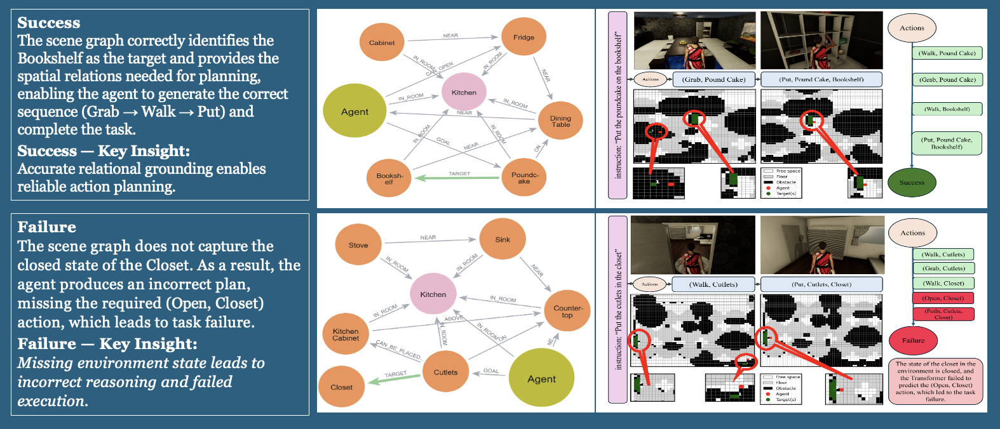

# KG-Transformer: Evidential Knowledge-Graph Planning for Safe Language-to-Action Execution

## Project Description

**KG-Transformer** is an uncertainty-aware and spatially grounded task planner designed to enable robots to interpret and execute natural language instructions safely and reliably. The framework unifies symbolic reasoning, probabilistic control, and real-time digital-twin validation to bridge the gap between language understanding and physically executable actions.

Unlike traditional planners that rely solely on static language embeddings or deterministic rules, KG-Transformer maintains an *evidential knowledge graph* — a probabilistic structure where each object, relation, and predicate carries a calibrated belief. This allows the robot to reason about uncertainty in perception and affordances before acting, leading to explainable, confidence-based decision-making.

The system integrates three core components:

- **Dynamic Knowledge Graph (KG)** – captures evolving object states, spatial relations, and uncertainties during task execution.  
- **Transformer-based Task Engine** – fuses language semantics with scene understanding to predict subgoals and corresponding robot actions.  
- **3D Digital Twin** – continuously validates predicted plans for safety, vetoing or repairing them under chance-constrained risk thresholds before real-world execution.

KG-Transformer is tested in both **simulation** (VirtualHome) and **real hardware** environments (JetBot for navigation and xArm Lite 6 for manipulation). The digital twin maintains metric alignment between symbolic states and geometric reality, ensuring that all plans are physically executable and safety-verified in real time.

---

## Core Highlights

- **Uncertainty-Aware Planning:** Incorporates evidential reasoning using Dirichlet (discrete) and Gaussian (continuous) distributions for robust decision-making in partially observable environments.
- **Symbolic–Physical Mapping:** Establishes a one-to-one link between VirtualHome primitives and robot controllers, ensuring interpretable, reproducible, and auditable sim-to-real transfer:contentReference[oaicite:2]{index=2}.
- **Digital-Twin Safety Layer:** Validates every action for collision, joint-limit, and contact feasibility—automatically repairing unsafe plans before execution.
- **Multi-Robot Capability:** Demonstrated on a mobile–manipulator setup, where a JetBot performs navigation and an xArm Lite 6 executes manipulation tasks.
- **Explainable AI Integration:** Each subgoal prediction, veto, or repair is traceable through the KG and safety logs, supporting transparent evaluation.

---

## Repository Media Placeholders

-  **Video Demonstration**

<iframe id="js_video_iframe" src="https://jumpshare.com/embed/8H0rFRzUgzmwwTKFpoo2" frameborder="0" webkitallowfullscreen mozallowfullscreen allowfullscreen style="position: absolute; top: 0; left: 0; width: 100%; height: 100%;"></iframe>

-  **Figure 1: Simulation case studies: success (top) and failure (bottom)**
  

-  **Figure 2: Real-world navigation and manipulation**
  

---

## Summary

KG-Transformer advances embodied AI by enabling interpretable, uncertainty-calibrated task planning that safely connects high-level language understanding with grounded physical execution. By combining evidence-based reasoning, 3D spatial grounding, and digital-twin safety gating, it achieves both explainability and reliability in real-world robotic operations.
